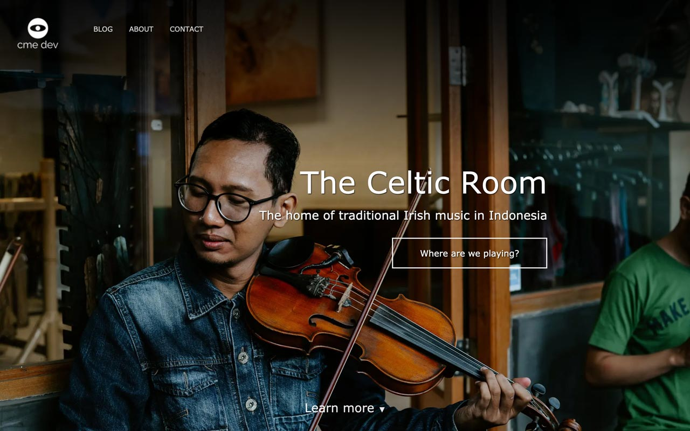

# The Celtic Room Template

The Celtic Room Template is perfect for _creatives_ who want a lightweight blog-enabled website with a sleek modern design.

## Features

- Mobile first
- Blog enabled
- Static generated site powered by Jekyll

... more to come.

## Build Status

---

## Visuals

First take on the hero. 

### Demos

- Latest [demo video](https://share.getcloudapp.com/5zuBY01y).

---

## I'll Drink to That ;-)

The Celtic Room Template is free to use. The template's images are subject to copyright.

